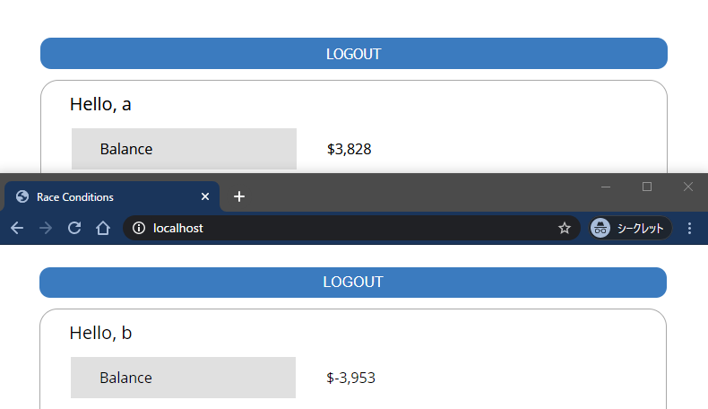

# race-condition-demonstrate
A Proof of Concept of a race-condition (also called race-hazard) with the virtual bank.

# Environments

Tested on:

- `Apache/2.4.43 (Win64) OpenSSL/1.1.1g PHP/7.4.6 via XAMPP`
- `PHP/7.4.6`
- `python>=3.7`

# Usage

1. Host the server (virtual bank) on the localhost (or whatever).

2. Make two accounts and tokens in web dashboard.

3. Copy the tokens in the script. (make sure the recipient username is correct)

4. Execute python script.

5. Check balances on the accounts.

`NUMBER_TO_EXECUTE` is proportional to the probability of success.

# What is the race condition?

# Issues

The virtual bank is still incomplete regarding its security features (like sql-injection, xss, or many other attack vectors), please note that this is just for tests for the race-condition and I do not care about another security masures.  

If you have any issues or bugs, your contribution is always welcome.
