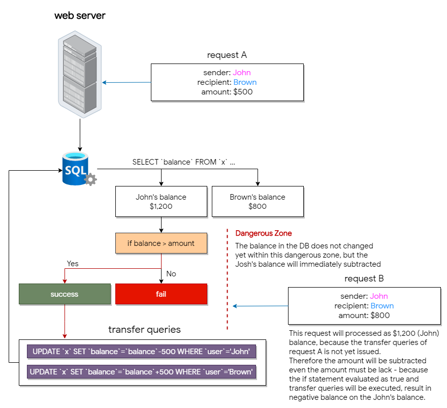

  
  
  

# race-condition-demonstrate

A Proof of Concept of a race-condition (also called race-hazard) with the virtual bank.

# Environments

Tested on:

- `Apache/2.4.43 (Win64) OpenSSL/1.1.1g PHP/7.4.6 via XAMPP`
- `PHP/7.4.6`
- `python>=3.7`
- `mysql 15.1 Distrib 10.4.11-MariaDB, for Win64 (AMD64)`

# Usage

1. Host the server (virtual bank) on the localhost (or whatever).

2. Make two accounts and tokens in web dashboard. (make sure you have enabled javascript)

3. Copy the tokens in the script. (make sure the recipient username is correct)

4. Execute python script.

5. Check balances on the accounts.

`NUMBER_TO_EXECUTE` is proportional to the probability of success.

# What is the race condition?

A race condition is an undesired state that occurs when multiple processes are performed at the same time on a system that performs parallel processing.  
This was happened in [JPMorgan Chase](https://chadscira.com/post/5fa269d46142ac544e013d6e/DISCLOSURE-Unlimited-Chase-Ultimate-Rewards-Points) and recently the information published. this also happened in [Starbucks](http://sakurity.com/blog/2015/05/21/starbucks.html) as well.

## Introduction

First of all, the webserver that I used in the testing environments, is Apache.  
The apache launches processes for every single requests, every time. (depends on what you have set in `httpd.conf`)  

Of course, we can say that the processes are processed parallelly. and the race-condition would happen, when the multiple processes are being processes at the same time, the same data referenced.  

# Issues

The virtual bank is still incomplete regarding its security features (like sql-injection, xss, or many other attack vectors), please note that this is just for tests for the race-condition and I do not care about another security masures.  

If you have any issues or bugs, your contribution is always welcome.
